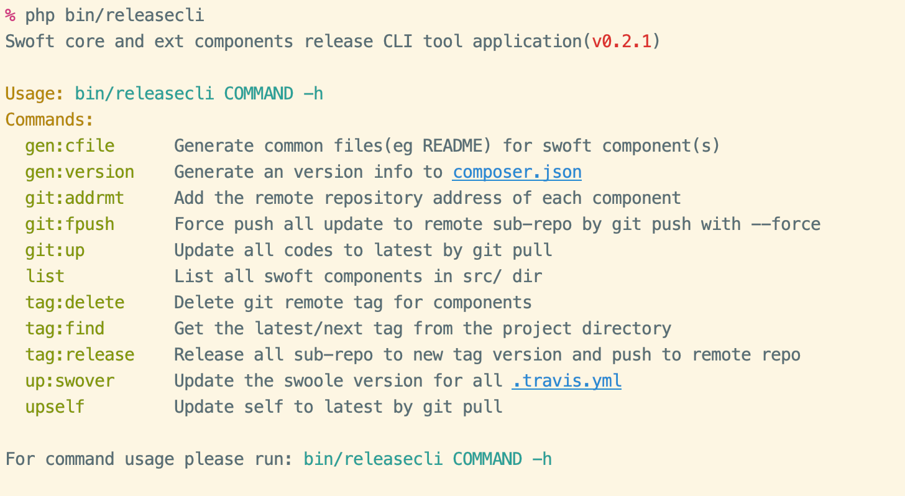

# Swoft Release CLI

Swoft core and ext components release CLI tool package.

- Synchronize the latest changes to each sub-repository
- Batch release of new versions

> Github https://github.com/swoftlabs/swoft-releasecli

**Required:**

- git
- php
- swoole
- composer

**Preview:**



## [中文说明](README.zh-CN.md)

## Install

### Install by script

```bash
curl https://raw.githubusercontent.com/swoftlabs/swoft-releasecli/master/install.sh | bash
```

### Manual install

```bash
cd ~
git clone https://github.com/swoftlabs/swoft-releasecli
cd swoft-releasecli
composer install
ln -s $PWD/bin/releasecli /usr/local/bin/releasecli
chmod a+x bin/releasecli
```

## Usage

First use git to pull the latest swoft-components or swoft-ext to the local, go to the repository directory.

Execute:

```bash
# 1. add remote for all components

releasecli git:addrmt --all
# 2. force push all change to every github repo
releasecli git:fpush --all

# 3. release new version for all components
releasecli git:release --all -y -t v2.0.8
```

## Update

### Builtin command

Use builtin command for update tool to latest

```bash
releasecli upself
```

### Manual update

```bash
cd ~/swoft-releasecli
git pull
chmod a+x bin/releasecli
```

## Build Phar

> Required the `swoftcli`

```bash
php -d phar.readonly=0 ~/.composer/vendor/bin/swoftcli phar:pack -o=releasecli.phar
```

## Uninstall

```bash
rm -f /usr/local/bin/releasecli
rm -rf ~/swoft-releasecli
```

## Dep Packages

- https://github.com/php-toolkit/cli-utils
- https://github.com/swoft-cloud/swoft-console
- https://github.com/swoft-cloud/swoft-stdlib
